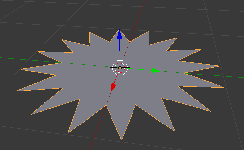

# STL-to-DXF-convert

## Why?

DXF is a messy format and pretty hard to handle. If you design your Graphics e.g. in `Blender`, then you might end up with something like this:



DXF export in `Blender` is messy, so better export it to STL and do it in `Openscad`, using this handy script.

Only limitation is, that your mesh needs to be filled. No bare edges allowed, otherwise they won't be in the final DXF file.


## Installation

```
git clone https://github.com/fablab-neckar-alb/stl-to-dxf-convert.git
cd stl-to-dxf-convert/
```

### With Nix

If you have Nix installed, just run

```
nix-env -i -f default.nix
```

to install the script and all dependencies.

### Without Nix

Usually you might want to run the script by hand. In this case just install `Openscad`, as it is a dependency to this script.

## Usage

Run the script and give it a file as an argument.

```
./stl-to-dxf-convert.sh myfile.stl
```

Nix users can just do `stl-to-dxf myfile.stl`.

This will result in a file `myfile.dxf`. Have fun!
